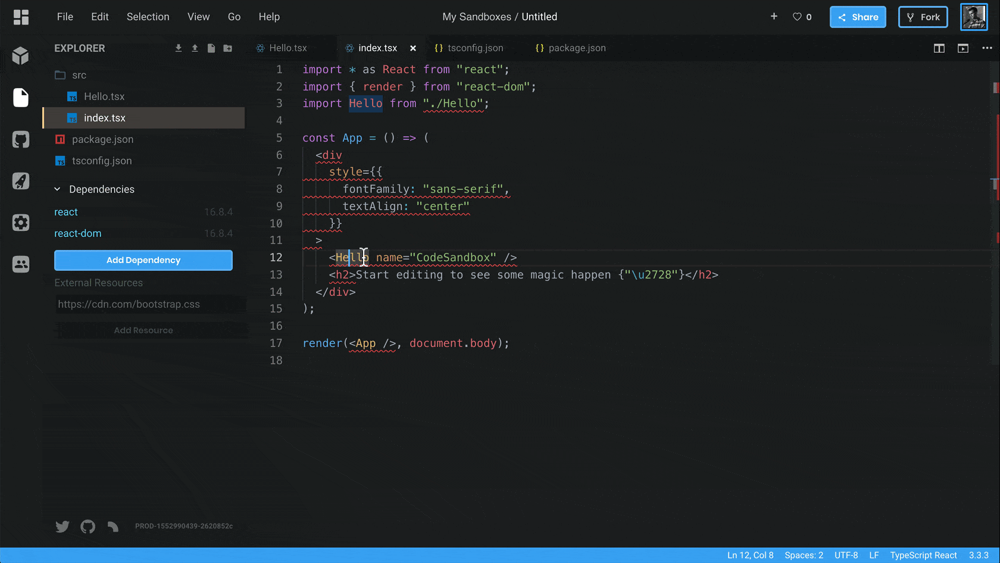
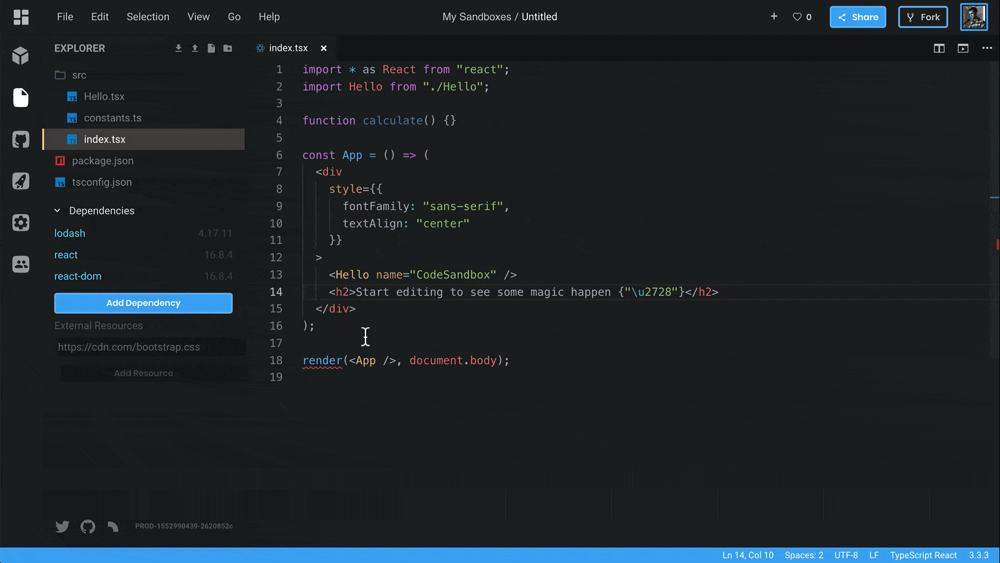
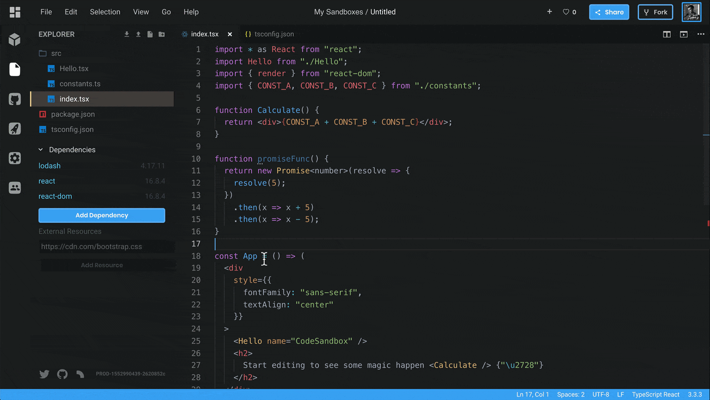
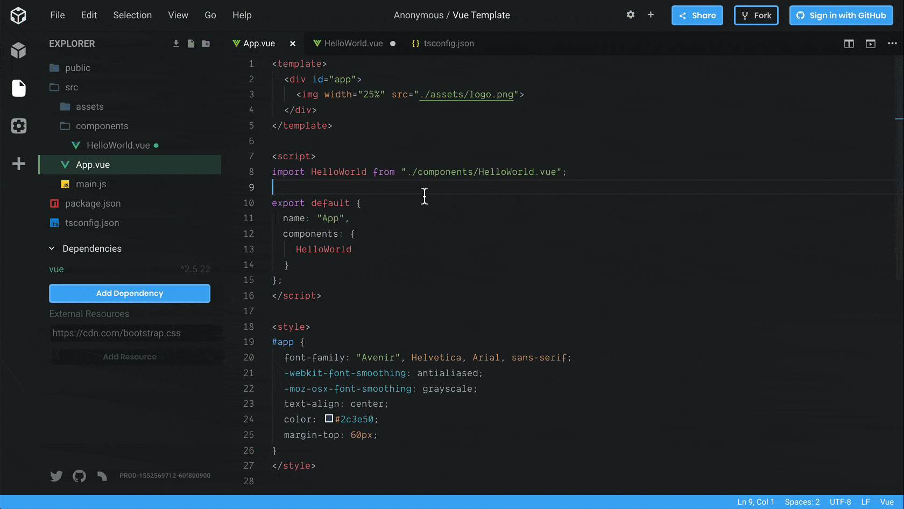
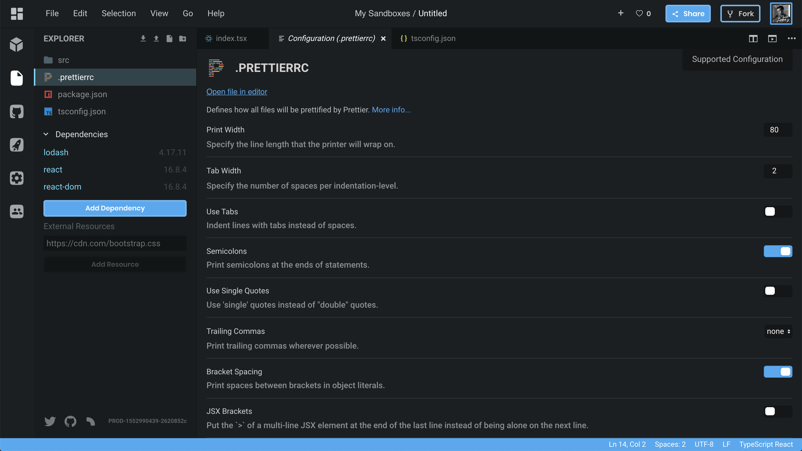
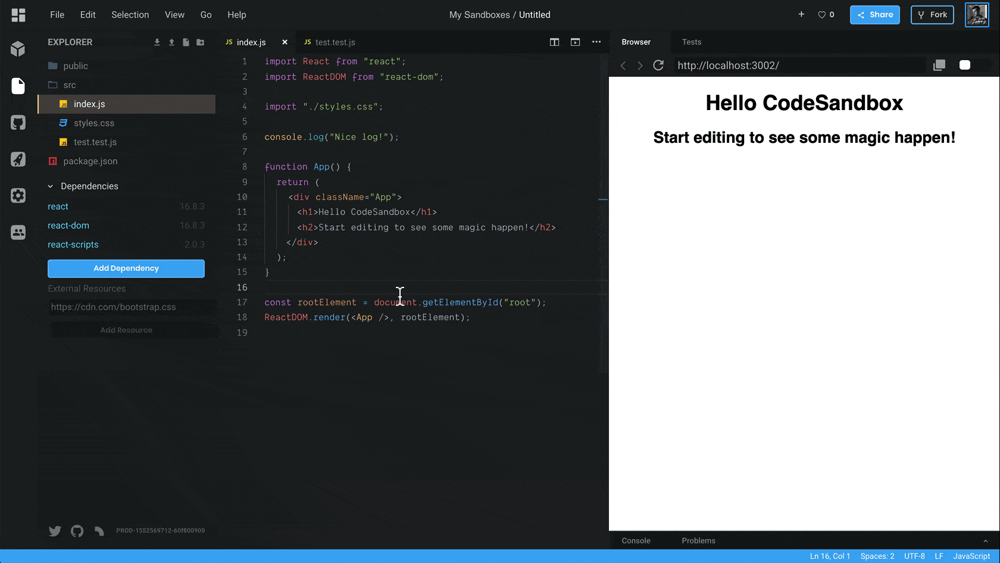
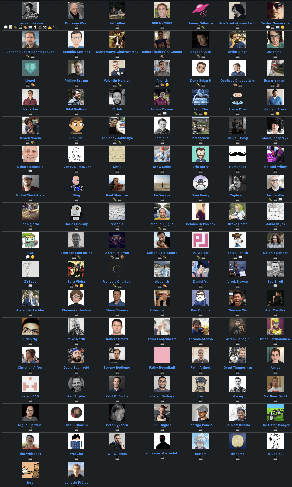

We're back with one of the biggest updates we've done so far! It's very similar
to the [CodeSandbox 2.5 update one year ago](/post/announcing-codesandbox-2-5).
It includes [VS Code](https://github.com/Microsoft/vscode) extensions, many
design tweaks, and a new devtool pane. [CodeSandbox](https://codesandbox.io)
will feel far more polished from now on. Let's get to it!

## VS Code Integration

In October we
[released an experimental version of VS Code](https://twitter.com/CompuIves/status/1052594462768148480)
that you could turn on in your preferences. This replaced the core editor in
CodeSandbox with VS Code, which gave us keybindings, user snippets, commands,
editor grid view and much more from VS Code.

Since October we've been fixing a bunch of bugs and improved the general
integration. From now on we'll run VS Code as the only editor in CodeSandbox,
and with that, we decided to give the editor a new look! Here's what was added
with the new integration:

#### Extensions Support

We now support
[VS Code Extensions](https://code.visualstudio.com/docs/editor/extension-gallery)!
The cool thing about this integration is that everything runs in the browser.
Instead of spawning [`node`](https://github.com/nodejs/node) processes, we spawn
[Web Workers](https://developer.mozilla.org/en-US/docs/Web/API/Web_Workers_API)
with stubbed `node` modules like
[`fs`](https://nodejs.org/api/fs.html#fs_file_system),
[`net`](https://nodejs.org/api/net.html#net_net) and
[`module`](https://nodejs.org/api/modules.html#modules_modules). This means that
there's less latency and there's no need for us to run servers for VS Code. I'll
do a better write-up on how this works after all the remaining releases.

Initially we'll support a predefined list of extensions, we'll gradually open up
the possibility for everyone to add and install their own extensions.

VS Code Extensions comes with a lot of new functionality, I want to highlight
some of the things that I found nice:

#### Native TypeScript Type Checking

The [TypeScript](https://github.com/Microsoft/TypeScript) extension runs exactly
the same as the local VS Code installation, it now reads `tsconfig.json`, will
give the same autocompletions and it runs the latest TypeScript version.

#### Auto Import

Automatically importing variables from your own files or dependencies now work!

#### Refactoring Support

You can also use
[the same refactoring options as in VS Code](https://code.visualstudio.com/docs/editor/refactoring),
like refactoring a function from promises to async, or moving a function to a
new file. It works exactly the same!

#### VIM Extension

We also include the [VSCodeVim](https://github.com/VSCodeVim/Vim) extension by
default, you can enable it by opening preferences and going to Editor.

#### Vue & Vetur

We also run the [Vetur](https://github.com/vuejs/vetur) extension from source,
which gives the same autocompletions,
[linting](<https://en.wikipedia.org/wiki/Lint_(software)>), and prettifying as
VS Code. It is really powerful, this also includes the recent addition of
autocompletions in templates.

#### Minor Improvements

We also added [GraphQL](https://graphql.org),
[`styled-components`](https://github.com/styled-components/styled-components)
and `yarn.lock` syntax highlighting/autocompletions using the new extensions.
Small quality of life improvements!

#### Existing Functionality in VS Code

Functionality that didn't work before, like the configuration UI and the image
viewer now work in VS Code as well. We added some custom editor types that are
actually rendered in [React](https://github.com/facebook/react), which is quite
interesting. We now mount VS Code in a React application, and we mount React in
the VS Code view.

## A New Design

Since we're now full-on on VS Code it was high time to adjust the design to fit
better with this code editor. We tweaked the design in many ways to give a more
coherent and less cluttered feel. I'll go by the changes one by one.

#### Devtool View

The browser preview has become multi-functional! We added tabs to the preview
(devtool) view that you can use to switch between different devtools. Browser is
the default devtool, but if you think that the console is more suitable for your
example you can just drag the tab to the first place to make it the default!

We think that this new devtool pane will make it easier for people to demo
things like tests or console output. This also affects the embed. Here's an
embed with the console pane as the first tab. Expect to see more devtools added
in the future!

https://codesandbox.io/s/v19jww3x3l?fontsize=14&view=split

#### Menu bar & Status bar

One big contributor to a cluttered look of the editor was the header. There were
so many buttons that it became hard to actually find the button you were looking
for. We decided to change this by removing a bunch of buttons and by putting
them under a menu that's familiar to many of you: the menu bar! We removed all
buttons that are not relevant to the editing experience (who goes to 'Explore'
from the editor?) and put them in the menu bar.

We also added a status bar, the functionality of the status bar became more
useful as we added extensions and support for the image view, for example. We're
planning to use this status bar quite a bit with CodeSandbox integrations in the
future.

Both the status bar and the menu bar are taken directly from VS Code! This is
one of the advantages of having VS Code as our single editor.

#### Color & Themes

Together with the new UI parts we also have a new color theme and new icons. You
can expect to see the CodeSandbox color theme in the
[VS Code marketplace](https://marketplace.visualstudio.com/vscode) in the
future!

#### Confusing Parts

Previously we would hide the activity bar (left most bar) when you were viewing
a sandbox that you don't own. We've reverted this, it turned out to be quite
confusing for people when they saw CodeSandbox for the first time.

#### Conclusion

I hope you're as excited about this update as I am! We've been working a long
time on this, and it's great that we can now show it to everyone. Let us know
what you think! Did you find something that didn't work? Please
[create an issue on our repo](https://github.com/codesandbox/codesandbox-client/issues/new/choose).

Also a huge thanks to
[all contributors](https://github.com/codesandbox/codesandbox-client/graphs/contributors)
who have contributed to CodeSandbox, we already have 114! The list almost
getting too big to show in one image!

This update is the first of 4 updates that we're releasing this week. Stay
tuned!
